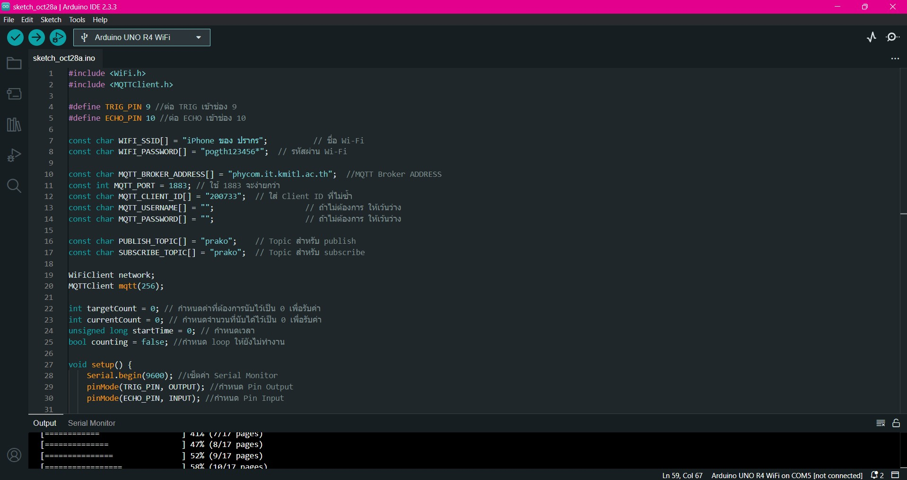
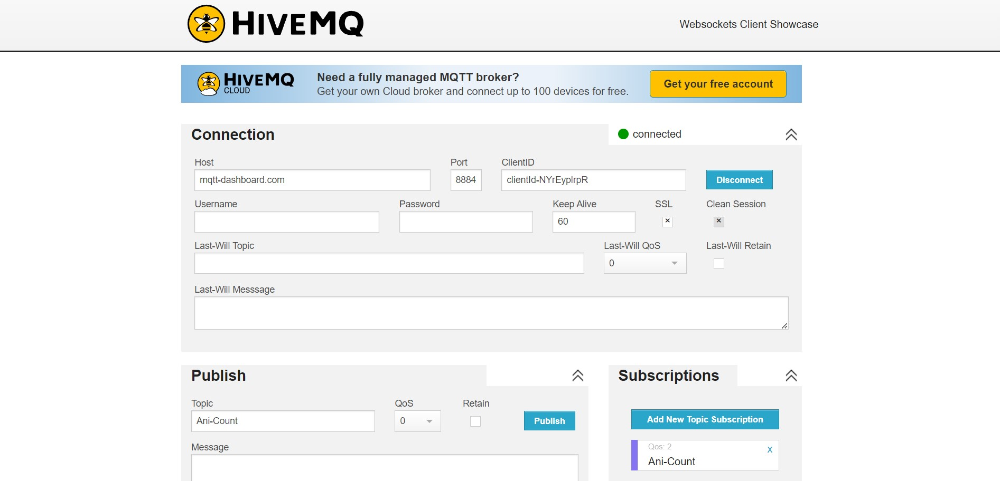

# Physical Computing Project 2024 - IT KMITL

## Project : Ani-Count

- [WebPage](https://prakorn2033.github.io/)
- [บทคัดย่อ](https://github.com/Prakorn2033/Ani-Count/blob/main/%E0%B8%9A%E0%B8%97%E0%B8%84%E0%B8%B1%E0%B8%94%E0%B8%A2%E0%B9%88%E0%B8%AD/%E0%B8%9A%E0%B8%97%E0%B8%84%E0%B8%B1%E0%B8%94%E0%B8%A2%E0%B9%88%E0%B8%AD.pdf)
- [Source Code](https://github.com/Prakorn2033/Ani-Count/blob/main/Source%20Code/Project_ani-count/Project_ani-count.ino)
- [ขั้นตอนการใช้งาน](https://github.com/Prakorn2033/Ani-Count/tree/main/%E0%B8%A7%E0%B8%B4%E0%B8%98%E0%B8%B5%E0%B8%81%E0%B8%B2%E0%B8%A3%E0%B9%83%E0%B8%8A%E0%B9%89%E0%B8%87%E0%B8%B2%E0%B8%99)
- [Clip VDO]
- [สมาชิก](https://github.com/Prakorn2033/Ani-Count/blob/main/README.md#contributors)
- [Poster](https://github.com/Prakorn2033/Ani-Count/blob/main/Poster/Poster-Ani-Count.png)

## Introduction to Ani-Count

สวัสดีครับ ใน Physical Computing Project ที่ผมจะมานำเสนอในโปรเจค Ani-Count 
คือเครื่องนับจำนวนสัตว์เลี้ยงที่เราเลี้ยงไว้ด้วยการนำเรื่องนี้ไปติดกับประตู และเซ็ตค่าผ่าน MQTT ได้เลยครับ
หรือก็คือเราสามารถส่งค่าที่ต้องการนับผ่าน Broker และให้ Ani-Count ช่วยเรานับสัตว์เลี้ยงที่ผ่านประตูอย่างง่ายดาย
เมื่อนับเสร็จ Ani-Count จะทำการแจ้งผ่าน Broker ที่เราเซ็ตค่าไว้ว่าจำนวนที่เรานับนั้นครบหรือไม่หรือมีสัตว์เลี้ยงของเรา
หายไปหรือไม่นั้นเอง

## Overview

Ani-Count ของเราพัฒนาด้วยภาษา C และใช้บอร์ด Arduino UNO R4 WiFi เป็นบอร์ด Arduino รุ่นต่อจาก UNO R3 ใช้ชิพ RA4M1 จาก Renesas เป็น 
Arm Cortex-M4 48 MHz 32 kB RAM 256 kB Flash ทำงานร่วมกับ ESP32-S3 กับ HC-SR04 Sensor เป็น Module Ultrasonic 
เป็น Sensor ใช้วัดระยะทางของวัตถุ หรือสิ่งกีดขวางที่อยู่ด้านหน้า Sensor โดยใช้หลักการส่งคลื่นเสียง ULTRASONIC ออกไป และรับคลื่นเสียงที่สะท้อนกลับมา
อุปกรณ์ทั้ง2ตัวใช้ในการรับค่าระยะทางที่แมวต้องเดินผ่าน และสุดท้าย MQTT เป็นโปรโตคอลการส่งข้อความที่อิงตามมาตรฐาน หรือชุดของกฎที่ใช้สำหรับการสื่อสารระหว่างเครื่องต่อเครื่อง
เซ็นเซอร์อัจฉริยะ อุปกรณ์สวมใส่ และอุปกรณ์ Internet of Things (IoT) เพื่อนำข้อความหรือค่าที่ได้จาก MQTT มาใช้ในการสั่ง Ani-Count รับค่าจำนวนที่ต้องการในการนับ

## Development Steps

1. ศึกษาขั้นตอนการใช้งานเครื่องมือผ่าน Github ที่ได้เรียนมาและหาข้อมูลเสริมในส่วนที่ต้องการ
2. ทดลองต่อบอร์ด Arduino เข้ากับ Wifi และ MQTT ที่หอ
3. ลองเขียนโค้ดรับค่าจาก MQTT และส่งกลับไป
4. เขียนฟังก์ชันการทำงานของ Ultrasonic Sensor และลองเอาค่าขึ้นไปบน MQTT
5. เขียนฟังก์ชันรับค่าจาก MQTT ส่งค่าไป Loop ให้ทำตามเงื่อนไขที่กำหนด
6. เช็คความสมบูรณ์ของโค้ดและให้บุคคลอื่นๆทดลอง Subscriptions และ Publish ค่าไปใช้ในการทำงานของตัว Ani-Count
7. ประกอบชิ้นงานให้สวยงานทำเว็ปและคลิปเพื่อแสดงข้อมูลของ Project

## Contributors

| รูป | รหัสนักศึกษา     | ชื่อ                  | ส่วนที่รับผิดชอบ               |
| --- | -------- | --------------------- | ------------------------------ |
|     | 62070115 | นาย ปรากรณ์ คำเภา       | Project : Ani-Count             |

## นำเสนอ

| รูป | ชื่อ                  | ตำแหน่ง               |
| --- | --------------------- | ------------------------------ |
|     | รศ.ดร. ปานวิทย์ ธุวะนุติ       | อาจารย์ประจำวิชา Physical Computing            |
|     | รศ.ดร. กิติ์สุชาต พสุภา      | อาจารย์ประจำวิชา Physical Computing            |

## Tools

- **Arduino IDE :** ใช้พัฒนา Source code ภาษา C เพื่อทำงานกับ บอร์ด Arduino UNO R4 WiFi และ ULTRASONIC

  

- **HiveQM :** ใช้ส่งค่าที่ต้องการเข้า arduino IDE เพื่อนำค่าไปใช้ใน Source code

  

## Source

- ### Github and Youtube
    - Using the HC-SR04 Ultrasonic Distance Sensor with Arduino.https://www.youtube.com/watch?v=6F1B_N6LuKw.
    - Week 12 - Digital To Analog.https://github.com/TaeTanakrit0089/PhysicalComputing-167/tree/main/labs/labs12-DigitalToAnalog.
    - Week 13 - Internet of Things.https://github.com/TaeTanakrit0089/PhysicalComputing-167/tree/main/labs/labs13-InternetOfThing.
    - สาธิตการเชื่อมต่อ MQTT.https://www.youtube.com/watch?v=xo3Y3RMGqbE.
