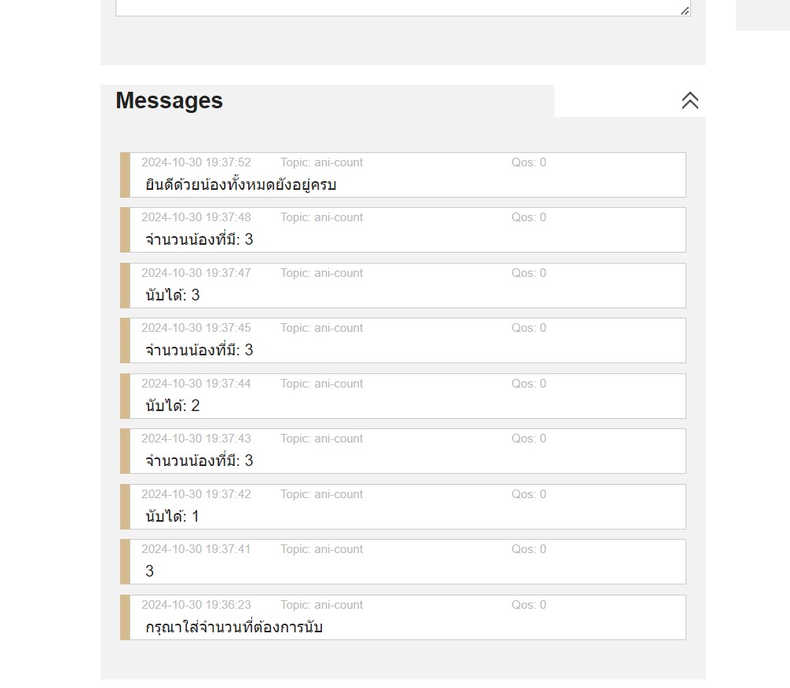

# ขั้นตอนการใช้งาน
- 1 นำตัวเครื่อง Ani-count มาเซ็ตค่า wifi password

  

  
  
- 2 ใส่ MQTT Broker ADDRESS ที่ได้จาก MQTT Broker

  
  
- 3 ตั้งค่า MQTT Broker ให้ Port เป็น 8884 และกด connect จากนั้นให้เปลี่ยน Topic บน MQTT Broker ตามใจชอบ และ Add new Topic Subscription ด้วยชื่อเดี่ยวกันเผื่อกันหลง จากนั้น Subscription

  

  
  
- 4 นำค่าที่ตั้งมาใส่ใน PUBLISH_TOPIC,SUBSCRIBE_TOPIC ส่วน MQTT_CLIENT_ID ให้ตั้งค่าได้ตามใจชอบแต่ต้องไม่ซ้ำกับคนอื่น ส่วนค่า MQTT_PORT หากใน MQTT Broker ที่ใช้ใช้ค่า 1883 อยู่ให้เปลื่ยนเป็นอย่างอื่น เช่น 8884 เป็นต้น พอเสร็จการตั้งค่าหมดแล้วก็กด upload และรอให้มัน upload จนเสร็จ

  

  
  
- 5.จากนั้นนำเครื่องไปติดตั้งและกดรีเซ็ตบอร์ด 1 ครั้ง

  
  
- 6.จะมีข้อความว่า กรุณาใส่จำนวนที่ต้องการนับ ให้ใส่จำนวนที่ต้องการนับในช่อง Message และกด Publish หลังจากนี้เครื่องก็จะสามารถทำงานได้แล้วครับ

  

  

